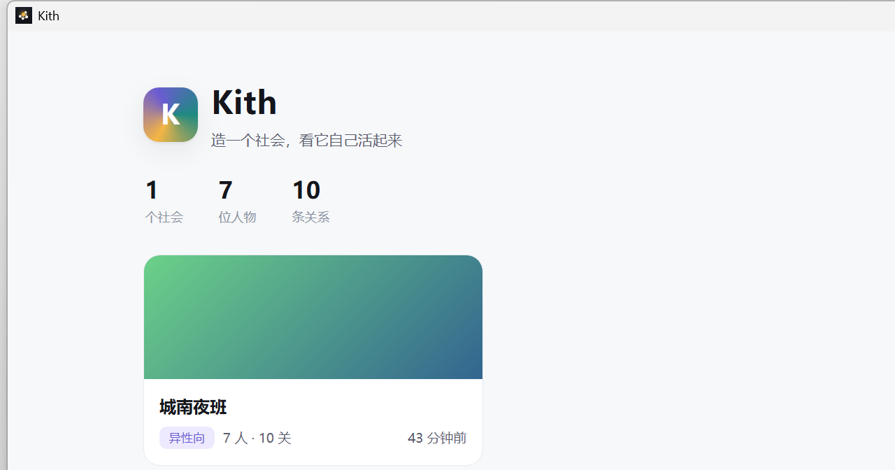
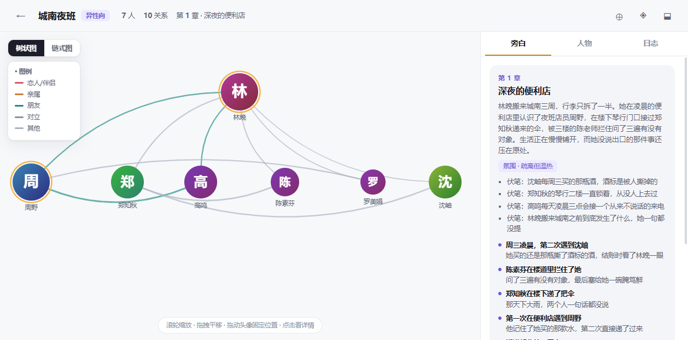
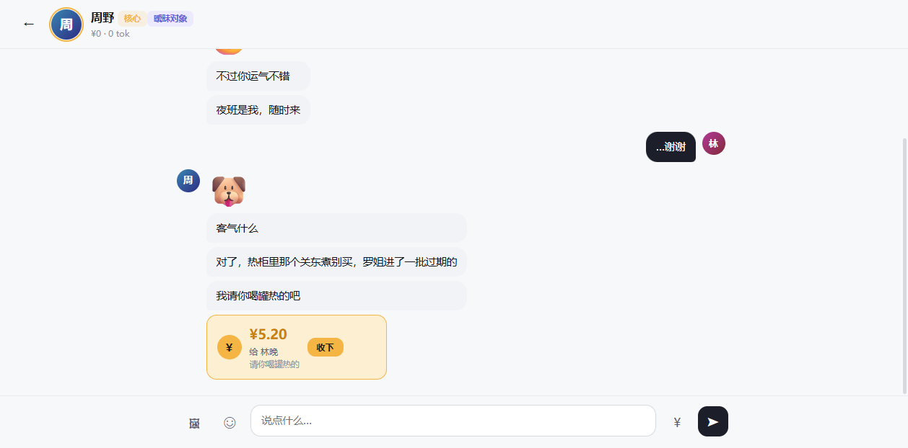
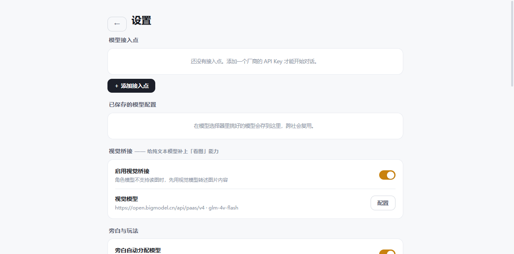

# Kith · 桌面端

[](https://github.com/wan101218/kith-android)
[](https://github.com/wan101218/kith-desktop)
[](https://github.com/wan101218/kith-desktop/releases)
[](./LICENSE)

造一个社会，看它自己活起来。

你设定世界观和几个初始人物，剩下的交给旁白引擎和人物智能体。他们会自己结盟、翻脸、谈恋爱、发图、转账，而你只是被拉进群的那个普通人。你可以像群里的一员那样说话，也可以退到上帝视角，用某个 NPC 的身份去跟别人聊。

这是 Windows 桌面端。**安卓端（手机 App）在另一个仓库，两边存档互通：**

> 👉 **https://github.com/wan101218/kith-android**



---

## 它在跑什么

旁白引擎推进一次剧情，可能创造新 NPC、改写关系、埋下伏笔。新 NPC 的关系对齐做了三级解析（id → 姓名 → 接不上就丢弃并记日志），宁可少几条关系，也不会生成一堆连不上的孤儿节点。

人物智能体各自独立。每个角色有人格卡，15 种内置关系标签（恋人、暧昧、宿敌、债主……）驱动语气和行为。他们之间的消息是闭塞的：你在 A 面前说的话，B 不知道。

角色输出支持 Human Chat Protocol，可以夹带表情包、AI 生成的图片、转账三种东西。流式输出时半截标签会被截断保护，不会把半个 `<sticker` 吐到屏幕上。转账是模拟的，没有真实资金流动，点"收下"只是把状态标记掉。

内置的目录快照有 256 个模型、42 家厂商接入点预设，其中 162 个支持视觉。配好几个接入点之后，旁白会按价格分位自动分档挑模型：写剧情这种费脑子的事交给强的，日常闲聊用便宜的。



关系图是 Canvas 画的，滚轮缩放，头像可以拖着摆位置，坐标会存下来。双击画布回到中心。



---

## 装上就能用

从 Releases 下载 `Kith-Setup-0.2.0.exe`（约 120 MB），双击，安装路径可以自己选。装完桌面有快捷方式，打开就是原生窗口：没有地址栏，任务栏上是 Kith 自己的图标。

装好之后还差一步——配 API Key，见下一节。

### 从源码跑

后端是 Python 3.13，只用标准库，没有第三方依赖：

```bash
python server/main.py 19287
```

然后开 `http://127.0.0.1:19287`。这是开发态，界面跑在浏览器里。想要原生窗口，用已经装配好的 Electron 便携版：

```bash
cd app && Kith.exe
```

重新打安装包：

```bash
cd installer
npm install
npm run dist      # 产物在 installer/dist/
```

安装包的组成：Electron 主进程拉起一个 PyInstaller 冻结的 `kith-server.exe`，等服务 ping 通了再把原生窗口指向 localhost。关窗口即完全退出。

---

## 配置 API Key

应用本身不提供任何模型服务，也不内置任何 Key，全部由你填自己的。设置页的路径是「设置 → 模型接入点 → ＋ 添加」，选好厂商会自动带出地址，粘 Key 保存即可。

两类能力分开配，缺哪样就少哪样功能，不影响其他部分。

### 1. 对话模型（旁白和角色说话靠它）

建议配 **2 到 3 个**，档次拉开。旁白引擎按价格分位自动分档：重要剧情用强模型，日常对白用便宜模型。只配一个也能跑，只是分档没得挑，全都走同一个。

几家可以直接用的（模型名和价格以厂商当期公告为准）：

| 厂商 | 接入地址 | 说明 |
| --- | --- | --- |
| DeepSeek | `https://api.deepseek.com/v1` | `deepseek-chat`，便宜量大，适合当主力档 |
| 智谱开放平台 | `https://open.bigmodel.cn/api/paas/v4` | 有免费档（如 GLM-4.5-Flash），适合当便宜档 |
| 硅基流动 SiliconFlow | `https://api.siliconflow.cn/v1` | 有免费额度的小模型（Qwen2.5-7B-Instruct 一类） |

一个务实的组合：DeepSeek 当中档主力，智谱免费档跑闲聊，再加一个贵一点的模型专供旁白。

配好之后到社会页顶栏点 ◈，给旁白、角色默认模型分别指定。也可以勾上「自动分配」，让应用自己按价格挑。

### 2. 视觉桥接（让不会看图的模型也能看懂你发的图）

推荐用 **智谱 GLM-4V-Flash，免费**：

- 接入地址：`https://open.bigmodel.cn/api/paas/v4`
- 模型名：`glm-4v-flash`
- Key：智谱开放平台的 Key（和上面对话模型可以共用同一个）

开启后你发一张图，应用先让视觉模型把图转成文字描述，再把描述交给对话模型。这样纯文本模型也能"看见"图片，角色会对着你发的照片说话。不配也能正常聊天，只是对方看不懂你发的图。

设置在「设置 → 视觉桥接」。

### Key 存在哪

只写在本机的 `data\settings.json`（安装版在 `%APPDATA%\Kith\data`）。不进仓库，不随 `*.kith.json` 存档导出，局域网同步页也拿不到 —— `/api/*` 只接受本机回环请求。

---

## 手机互通

同一 Wi-Fi 下，手机浏览器访问：

```
http://<电脑的局域网IP>:19287/sync
```

可以在手机上下载电脑的社会，也可以把手机导出的存档传上来。首页的「⇄ 手机同步」按钮会显示当前地址。

### 存档格式（给手机端适配用）

`*.kith.json`，schema `kith.society/1`。两端都按这份约定读写：

```jsonc
{
  "schema": "kith.society/1",
  "coverImageB64": "<裸 base64，不含 data: 前缀>",   // 封面随档走，顶层字段
  "society": {
    "coverImage": "img_xxx.png",                     // media 目录下的裸文件名
    "narratorModel": { "endpointId": "...", "modelId": "...", "label": "...", "vendor": "..." }
  },
  "characters": [], "relations": [], "plot": {}, "stickers": [], "chats": []
}
```

导出端把封面文件读成裸 base64 塞进顶层 `coverImageB64`；导入端解码后写进自己的 media 目录，并把文件名记到 `society.coverImage`。`coverImage` 本身是本地引用，不随档传播；如果是 http 或 data 开头的远程引用则直传。

---

## 数据存在哪

| 运行形态 | 数据目录 |
| --- | --- |
| 安装版 | `%APPDATA%\Kith\data` |
| 便携版 / 开发态 | 程序目录或项目根下的 `data\` |

`settings.json` 存接入点和 API Key，只在本机。社会数据按 id 分目录放在 `data\societies\`，会话、剧情、日志都在各自目录里。



---

## 目录结构

```
server/       Python 后端：HTTP 服务、旁白引擎、人物智能体、协议解析、模型目录
web/          原生 HTML/CSS/JS 前端（没有框架，没有构建步骤）
app-src/      Electron 主进程源码
app/          装配好的便携版运行时（Kith.exe），体积大，不入库
installer/    electron-builder 工程，产出 NSIS 安装包
assets/       模型目录快照 model_catalog.json
tools/        构建与诊断脚本（含手写 .lnk 生成器、GPU 模式矩阵测试、打包装配）
docs/         截图与文档
```

---

## 几个需要知道的事

开发这台机器上 Chromium 的 GPU 进程起不来，沙箱初始化直接失败，所以默认跑 `no-sandbox` + 软件渲染。本应用只加载本机页面，代价可以接受。换到正常机器上想开硬件加速，改 `data\gpu-mode.txt` 里的值（a/b/c/d 四种，默认 a）。

包体 120 MB 是因为带了 Electron。原本想用 WebView2，那台机器上没有运行时，只能自己带 Chromium。

目录里 Ollama 源模型的 vendor 标的是原厂（阿里、DeepSeek 等），所以给 Ollama 接入点过滤模型会显示 0 条。这是上游数据源的写法。

端侧内容审核（Qwen3Guard 0.6B GGUF）是手机端的能力，桌面端没有移植，只有一份规则体检（空输出、过短、重复、标签未闭合），在设置里可开。

---

## 许可

MIT。见 [LICENSE](./LICENSE)。

第三方资源的许可各不相同：模型目录快照来自 OpenRouter，内置云舟接入点只是预置地址，Key 需要你自己申请。模型调用产生的费用由你自己的账号承担。
